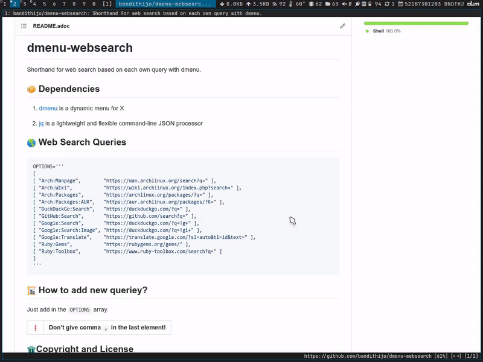

= dmenu-websearch
ifndef::env-github[:icons: font]
ifdef::env-github[]
:outfilesuffix: .adoc
:caution-caption: :fire:
:important-caption: :exclamation:
:note-caption: :paperclip:
:tip-caption: :bulb:
:warning-caption: :warning:
endif::[]
:hardbreaks-option:
:experimental:

Shorthand for web search based on each own query with dmenu.

== image:.emoji/1f4e6.png[Package,width=30] Dependencies

. link:https://tools.suckless.org/dmenu/[dmenu^] is a dynamic menu for X
. link:https://github.com/stedolan/jq[jq^] is a lightweight and flexible command-line JSON processor

== image:.emoji/1f30e.png[Globe,width=30] Web Search Queries

.urlquery
[source,bash,linenums]
----
[ "Arch:Manpage",        "https://man.archlinux.org/search?q=" ],
[ "Arch:Wiki",           "https://wiki.archlinux.org/index.php?search=" ],
[ "Arch:Packages",       "https://archlinux.org/packages/?q=" ],
[ "Arch:Packages:AUR",   "https://aur.archlinux.org/packages/?K=" ],
[ "DuckDuckGo:Search",   "https://duckduckgo.com/?q=" ],
[ "GitHub:Search",       "https://github.com/search?q=" ],
[ "Google:Search",       "https://duckduckgo.com/?q=!g+" ],
[ "Google:Search:Image", "https://duckduckgo.com/?q=!gi+" ],
[ "Google:Translate",    "https://translate.google.com/?sl=auto&tl=id&text=" ],
[ "Ruby:Gems",           "https://rubygems.org/gems/" ],
[ "Ruby:Toolbox",        "https://www.ruby-toolbox.com/search?q=" ],
----

== image:.emoji/1f3d7.png[Building Construction,width=30] How to add new query?

Just add new URL query via *Add:New:Query* menu. It will asking about value of *prefix menu* & *URL query*.

== image:.emoji/1f371.png[Bento Box,width=30] How to use?

Complete the *perfix menu* with kbd:[Tab], and write down your keywords.

The form should be like this,

----
Prefix:Menu <your> <keywords>
----

TIP: You're free to define the *prefix menu*. My example is just for ease to explaining.

== image:.emoji/1f69a.png[Truck,width=35] Demo

image::.image/gambar-02.gif[demo-02,align=center]

== TODO

- [x] Create a menu to add a query
- [x] Retrieve query url value from urlquery file
- [x] Create urlquery.example and enter the urlquery into gitignore
- [x] If urlquery does not exist, create new from urlquery.example
- [x] Do not put in the urlquery file if the menu prefix & query url are empty
- [x] Create a menu to delete the selected data url query from the urlquery file
- [ ] Create a menu to edit the selected data url query from the urlquery file

== image:.emoji/1f37b.png[Clinking Beer Mugs,width=30] Related Project

. link:https://github.com/m0rphism/haskell-dmenu-search[haskell-dmenu-search^], dmenu script for searching the web with customizable search engines.
. link:https://gitlab.com/surfraw/Surfraw/[surfraw^], Shell Users' Revolutionary Front Rage Against the Web.

== image:.emoji/1f3db.png[Classical Building,width=30] Copyright and License

Copyright © 2021 Rizqi Nur Assyaufi. Free use of this software is granted under the terms of the MIT License.
See link:https://raw.githubusercontent.com/bandithijo/dmenu-websearch/master/LICENSE[LICENSE^] for details.
